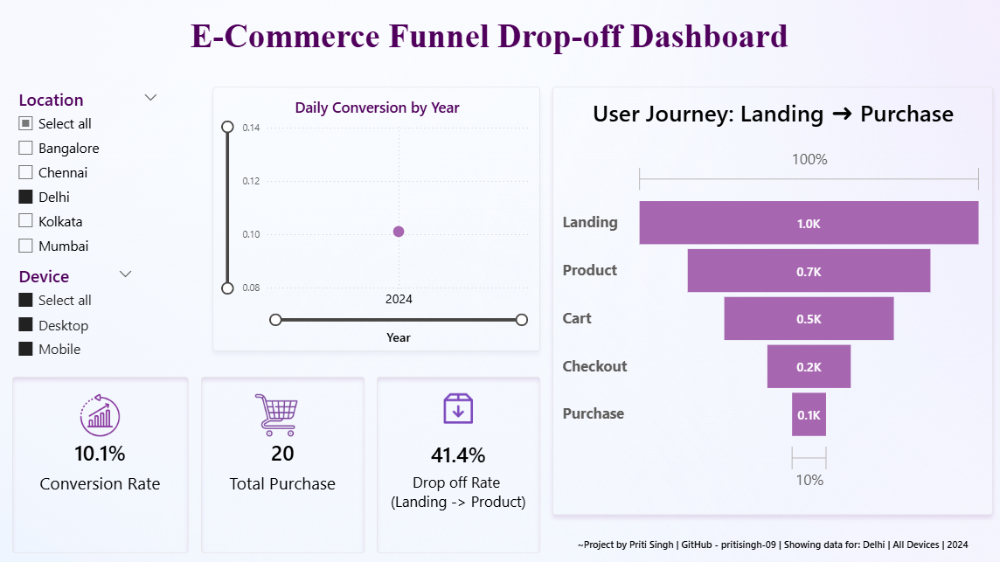

# 📊 E-Commerce Funnel Drop-off Analysis

This Power BI project visualizes and analyzes user drop-off across an e-commerce website’s conversion funnel — from Landing to Purchase. It uses mock session-level data to track performance at each stage of the funnel and calculate key metrics like conversion rate and drop-off rate.

---

---

## 🎯 Goals

- Understand user behavior across funnel stages
- Identify where most users are dropping off (e.g., from Landing to Product)
- Track conversion performance by Location, Device, and Year
- Communicate insights visually for stakeholders or recruiters

## 🔍 Features

- Interactive filters by **Location**, **Device**, and **Year**
- Custom **DAX Measures** for:
  - Total Landing Sessions
  - Total Purchases
  - Conversion Rate
  - Drop-off Rate (Landing → Product)
- Funnel chart: Session count across all stages (Landing → Purchase)
- KPI Cards with clear visuals
- Dynamic Title and Footer for storytelling

## 📁 File Contents

- `Ecommerce_Funnel_Dropoff_Analysis.pbix` — Power BI Dashboard file
- `DAX_Calculations.txt` — All custom DAX measures used in the project
- `Dashboard.png` — Static preview of the final dashboard
- `README.md` — This file (Project overview and documentation)

## 📌 Tools Used

- Microsoft Power BI Desktop
- DAX (Data Analysis Expressions)
- Mock e-commerce session data (CSV)

---

## 📝 License

This project is licensed under the [MIT License](LICENSE).  
Feel free to use it for educational or personal learning purposes with proper credit.
